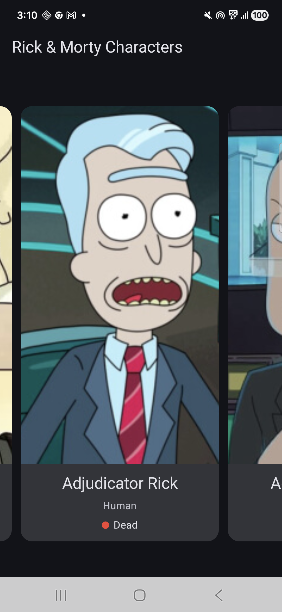
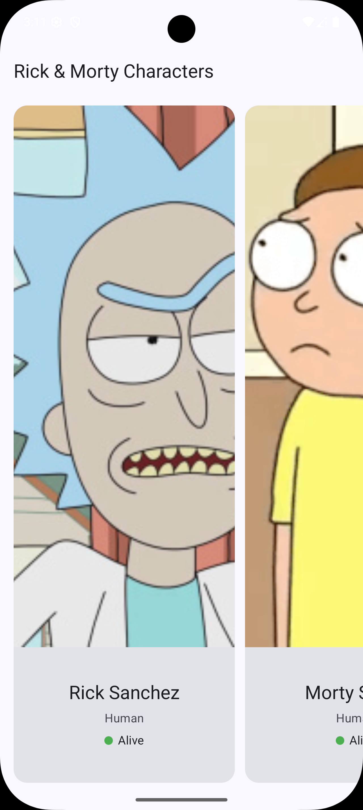

# Rick and Morty Character List

App Android que consume la [Rick and Morty API](https://rickandmortyapi.com/api/character) y muestra una lista de personajes.

---

## Screenshots

<p align="center">
  
  &nbsp;&nbsp;&nbsp;
  
</p>

---

## Stack técnico

- **Lenguaje:** Kotlin
- **UI:** Jetpack Compose 
- **Arquitectura:** MVVM + Clean Architecture (UseCase + Repository)
- **Patrón UI:** MVI con sealed class `UiState`
- **Networking:** Retrofit + OkHttp + Kotlin Serialization
- **Imágenes:** Coil (Compose)
- **Estado:** StateFlow
- **DI:** Hilt
- **Coroutines:** para operaciones asíncronas

---

## Estructura de paquetes

```
com.kenny.rickandmortyapp/
├── data/
│   ├── remote/
│   │   ├── api/RickAndMortyApi.kt
│   │   ├── dto/CharacterResponseDto.kt
│   │   ├── dto/CharacterDto.kt
│   │   └── mapper/CharacterMapper.kt
│   └── repository/CharacterRepositoryImpl.kt
├── domain/
│   ├── model/Character.kt
│   ├── repository/CharacterRepository.kt
│   └── usecase/GetCharactersUseCase.kt
├── presentation/
│   ├── characters/
│   │   ├── CharactersViewModel.kt
│   │   ├── CharactersUiState.kt
│   │   └── CharactersScreen.kt
│   └── components/
│       ├── CharacterItem.kt
│       ├── LoadingScreen.kt
│       └── ErrorScreen.kt
├── di/AppModule.kt
└── RickAndMortyApp.kt
```

---

## Decisiones técnicas

- **MVVM + Clean Architecture** para separación de responsabilidades: la UI no conoce la fuente de datos, y el dominio no depende de Android.
- **MVI en la capa de presentación** con `sealed class CharactersUiState` (`Loading`, `Success`, `Error`) para manejo explícito y exhaustivo de estados.
- **Coil** para carga de imágenes por su integración nativa con Compose, manejo automático de caché y cancelación de corrutinas.
- **Hilt** para inyección de dependencias, reduciendo boilerplate y facilitando testabilidad.
- **StateFlow** para reactividad del estado UI, integrado nativamente con `collectAsStateWithLifecycle`.
- **`Result<T>`** de Kotlin para manejo de éxito/fallo en el repositorio, evitando excepciones no controladas.
- **Kotlin Serialization** sobre Gson/Moshi por ser type-safe en compilación, compatible nativo con Kotlin y sin reflection en runtime.

---

## Qué quedó fuera por tiempo

- Paginación (la API soporta paginado con `next`/`prev` en `InfoDto`)
- Pantalla de detalle del personaje
- Tests unitarios (ViewModel, UseCase, Repository)
- Búsqueda/filtrado de personajes
- Caché local con Room

---

## Qué mejoraría con más tiempo

- Implementar paginación para scroll infinito consumiendo el paginado de la API
- Agregar **tests unitarios** con MockK/Turbine para ViewModel y UseCase, y tests de UI con Compose Test
- **Pantalla de detalle** con navegación via Navigation Compose
- **Manejo de conectividad offline** con Room como caché local 

---

## Uso de IA

Se utilizó IA como asistente de desarrollo y principal herramienta de apoyo en la implementación del código. Las tareas se asignaron al modelo adecuado siguiendo las buenas prácticas de Android y las decisiones de arquitectura definidas por el ingeniero a cargo.

En este proceso, la IA se enfoca en la ejecución técnica, mientras que el ingeniero lidera el diseño y la arquitectura de la aplicación, dirigiendo el uso del modelo de Claude.